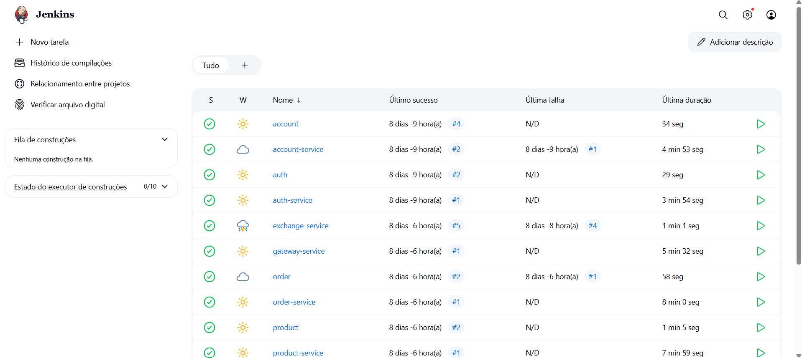
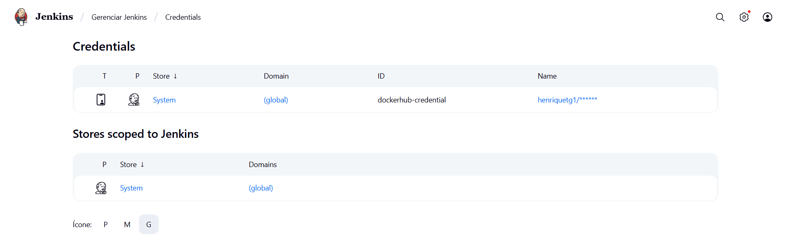

# Jenkins

Nesta fase do projeto, o objetivo era criar pipelines no Jenkins, conectando cada repositório de microsserviço para automatizar o build e a publicação das imagens Docker.

---

#### Interface Jenkins

A seguir, temos a visão geral da interface do Jenkins com os jobs configurados:

**Dashboard do Jenkins**


Cada serviço (interface ou service) foi adicionado como um pipeline separado.

---

#### Credencial Docker Hub

Para permitir o **push automático de imagens Docker**, foi configurada uma credencial do tipo *Username + Password* com o ID `dockerhub-credential`, conforme a imagem abaixo:

**Credential configurada**


---

#### Jenkinsfile (Interfaces)

As interfaces (como `product`, `order`, `account`) utilizam um Jenkinsfile simples para build Maven:

```groovy
pipeline {
    agent any

    stages {
        stage('Build') {
            steps {
                sh 'mvn -B -DskipTests clean install'
            }
        }
    }
}
```

Este pipeline **compila o código** e garante que as dependências estejam corretas, mas não realiza deploy de imagens.

---

#### Jenkinsfile (Services)

Para os services (como `order-service`, `product-service`, etc.), o Jenkinsfile realiza também o build da imagem Docker e seu push para o Docker Hub:

```groovy
ppipeline {
    agent any
    environment {
        SERVICE = 'order-service'
        NAME = "henriquetg1/${env.SERVICE}"
    }
    stages {
        stage('Dependecies') {
            steps {
                build job: 'order', wait: true
            }
        }
        stage('Build') { 
            steps {
                sh 'mvn -B -DskipTests clean package'
            }
        }      
        stage('Build & Push Image') {
            steps {
                withCredentials([usernamePassword(credentialsId: 'dockerhub-credential', usernameVariable: 'USERNAME', passwordVariable: 'TOKEN')]) {
                    sh "docker login -u $USERNAME -p $TOKEN"
                    sh "docker buildx create --use --platform=linux/arm64,linux/amd64 --node multi-platform-builder-${env.SERVICE} --name multi-platform-builder-${env.SERVICE}"
                    sh "docker buildx build --platform=linux/arm64,linux/amd64 --push --tag ${env.NAME}:latest --tag ${env.NAME}:${env.BUILD_ID} -f Dockerfile ."
                    sh "docker buildx rm --force multi-platform-builder-${env.SERVICE}"
                }
            }
        }
    }
}
```

Esse pipeline **compila, empacota, constrói e publica a imagem** usando multi-platform Docker build.