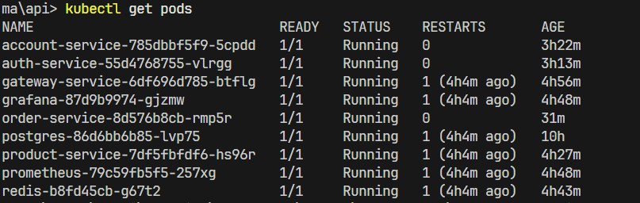
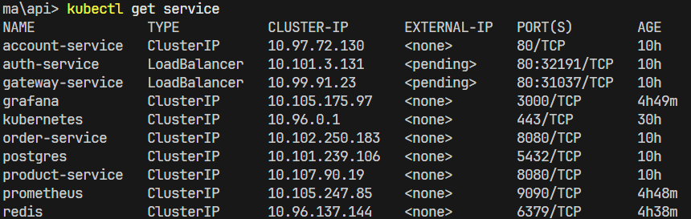

# MiniKube

## Objetivo

Executar todos os microserviços em um cluster Kubernetes local usando o Minikube, reproduzindo um ambiente de orquestração completo.

---

## Pré-Requisitos

* Docker instalado e rodando
* Minikube instalado
* kubectl instalado

---

## Passos para iniciar

### 1. Iniciar o Minikube

No terminal, rode:

```bash
minikube start --driver=docker
```

---

### 2. Clonar e navegar até o projeto

```bash
cd platforma/api/k8s
```

Esse diretório contém os arquivos YAML de `deployment` e `service` para:

* `account-service`
* `auth-service`
* `exchange-service`
* `gateway-service`
* `order-service`
* `product-service`
* `postgres-service`

---

### 3. Aplicar todos os arquivos

```bash
kubectl apply -f .
```

> Esse comando lê todos os arquivos `.yml` do diretório atual e sobe os pods e serviços no cluster.

---

### 4. Verificar status

#### Pods

```bash
kubectl get pods
```

#### Serviços

```bash
kubectl get service
```

#### Retorno Esperado:




---

## Acessando a aplicação

Se quiser acessar algum serviço (ex: `gateway-service`) localmente via browser:

```bash
minikube service gateway-service
```

Isso abre automaticamente o serviço no navegador com um **túnel temporário** via Minikube.

---

## Arquitetura do `k8s/`

```
k8s/
├─ account-service/
   ├─ k8s.yaml 
├─ auth-service/
   ├─ k8s.yaml 
├─ gateway-service/
   ├─ k8s.yaml 
├─ order-service/
   ├─ k8s.yaml 
├─ postgres-service/
   ├─ configmap.yaml 
   ├─ deployment.yaml 
   ├─ secrets.yaml 
   ├─ service.yaml 
└─ product-service/
   ├─ k8s.yaml 
```

---