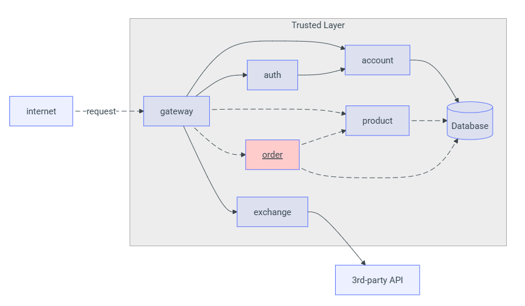
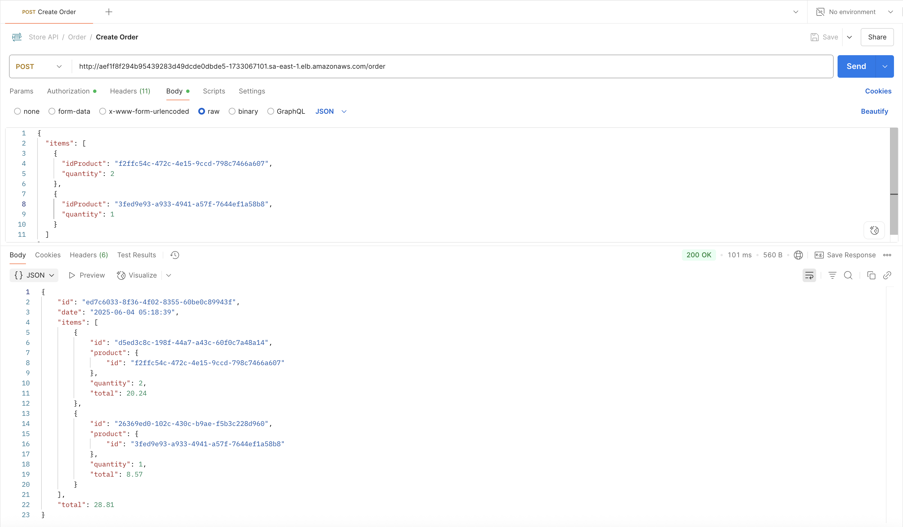
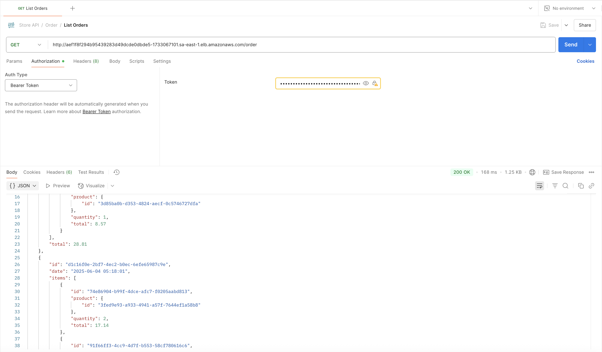
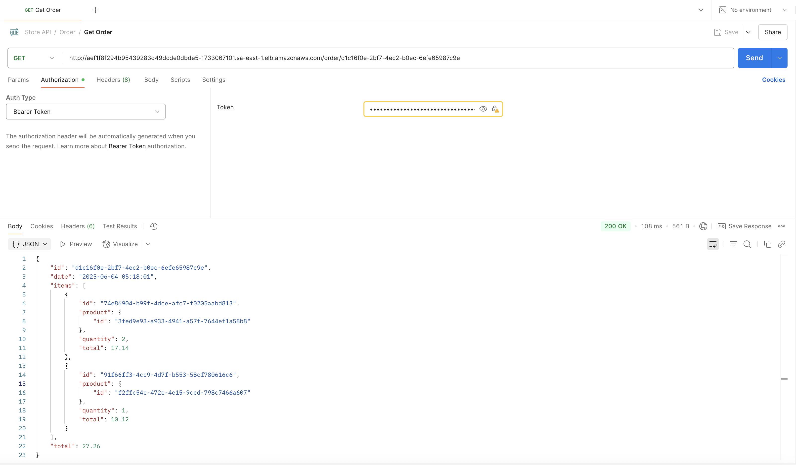

O Order API foi desenvolvido em **Spring Boot (Java)** e fornece um conjunto de endpoints REST para gerenciar pedidos de uma loja. Todas as requisições passam pelo **API Gateway**, que valida o token JWT antes de encaminhar ao serviço.

---

## Endpoints Principais

**Criar novo pedido**  
- **POST** `/order`  
- **Headers**:  
  ```
  Authorization: Bearer <token-JWT>
  ```  
- **Request Body** (JSON):  
  ```json
  {
        "items": [
            {
                "idProduct": "0195abfb-7074-73a9-9d26-b4b9fbaab0a8",
                "quantity": 2
            },
            {
                "idProduct": "0195abfe-e416-7052-be3b-27cdaf12a984",
                "quantity": 1
            }
        ]
    }   
  ```  
- **Response** (JSON — código HTTP 201 Created):  
  ```json
  {
        "id": "0195ac33-73e5-7cb3-90ca-7b5e7e549569",
        "date": "2025-09-01T12:30:00",
        "items": [
            {
                "id": "01961b9a-bca2-78c4-9be1-7092b261f217",
                "product": {
                    "id": "0195abfb-7074-73a9-9d26-b4b9fbaab0a8"
                },
                "quantity": 2,
                "total": 20.24
            },
            {
                "id": "01961b9b-08fd-76a5-8508-cdb6cd5c27ab",
                "product": {
                    "id": "0195abfe-e416-7052-be3b-27cdaf12a984"
                },
                "quantity": 10,
                "total": 6.2
            }
        ],
        "total": 26.44
    }
  ```

**Listar todos os pedidos**  
- **GET** `/order`  
- **Headers**:  
  ```
  Authorization: Bearer <token-JWT>
  ```  
- **Response** (JSON Array — código HTTP 200 OK):  
  ```json
    [
        {
            "id": "0195ac33-73e5-7cb3-90ca-7b5e7e549569",
            "date": "2025-09-01T12:30:00",
            "total": 26.44
        },
        {
            "id": "0195ac33-cbbd-7a6e-a15b-b85402cf143f",
            "date": "2025-10-09T03:21:57",
            "total": 18.6
        }
    ]
  ```

**Obter pedido por ID**  
- **GET** `/order/{id}`  
- **Headers**:  
  ```
  Authorization: Bearer <token-JWT>
  ```  
- **Response** (JSON — código HTTP 200 OK):  
  ```json
    {
        "id": "0195ac33-73e5-7cb3-90ca-7b5e7e549569",
        "date": "2025-09-01T12:30:00",
        "items": [
            {
                "id": "01961b9a-bca2-78c4-9be1-7092b261f217",
                "product": {
                    "id": "0195abfb-7074-73a9-9d26-b4b9fbaab0a8",
                },
                "quantity": 2,
                "total": 20.24
            },
            {
                "id": "01961b9b-08fd-76a5-8508-cdb6cd5c27ab",
                "product": {
                    "id": "0195abfe-e416-7052-be3b-27cdaf12a984",
                },
                "quantity": 10,
                "total": 6.2
            }
        ],
        "total": 26.44
    }
  ```  
- **Caso o pedido não exista**: retorna **404 Not Found** com corpo vazio.

---

## Autenticação

- Todas as chamadas aos endpoints acima exigem um **token JWT** válido.  
- O token deve ser produzido pelo **Auth Service** e passado no cabeçalho:

---

### Diagrama de Integração com Gateway



---

### Testes das rotas com Postman

_Teste com criação de um pedido_  
  

_Teste para ver todos os pedidos cadastrados_  
  

_Teste para ver um pedido cadastrado específico_  
  
 
