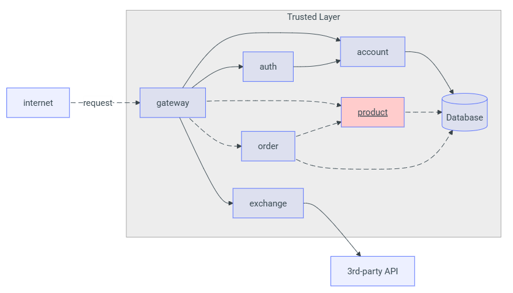
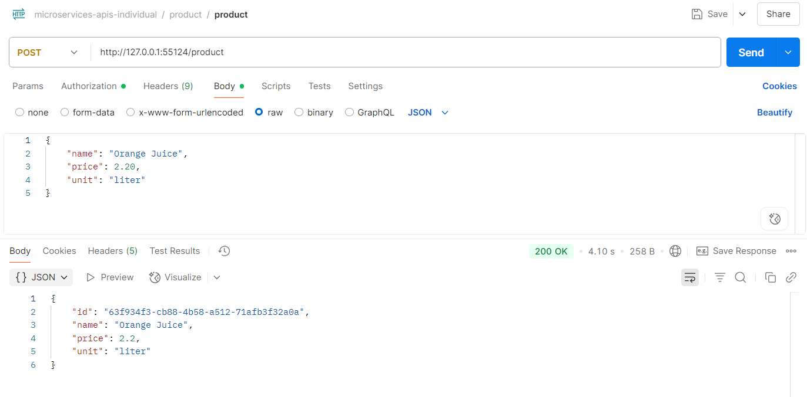
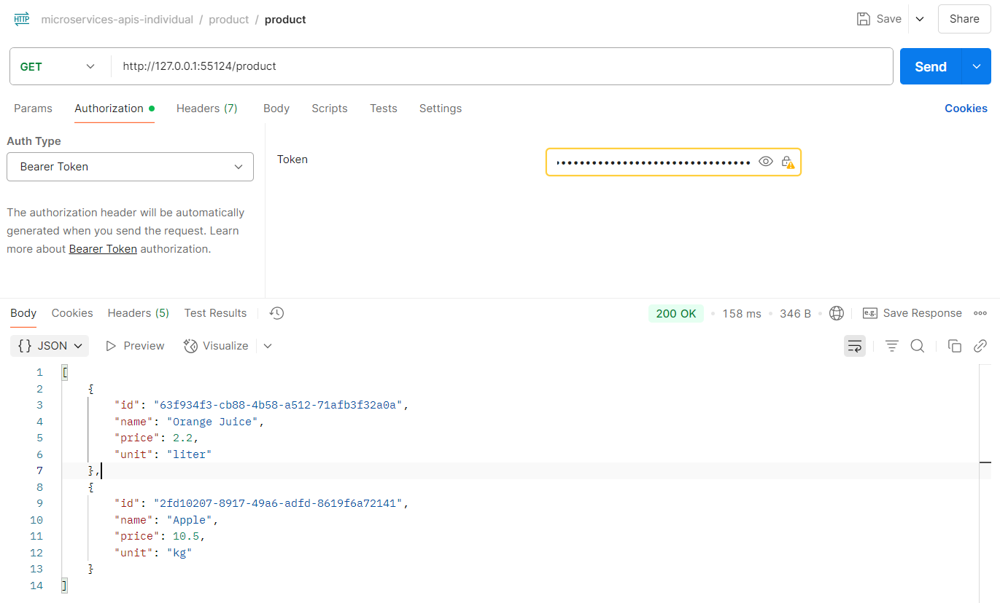
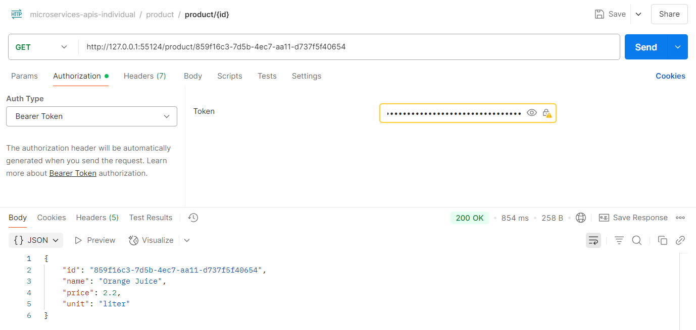
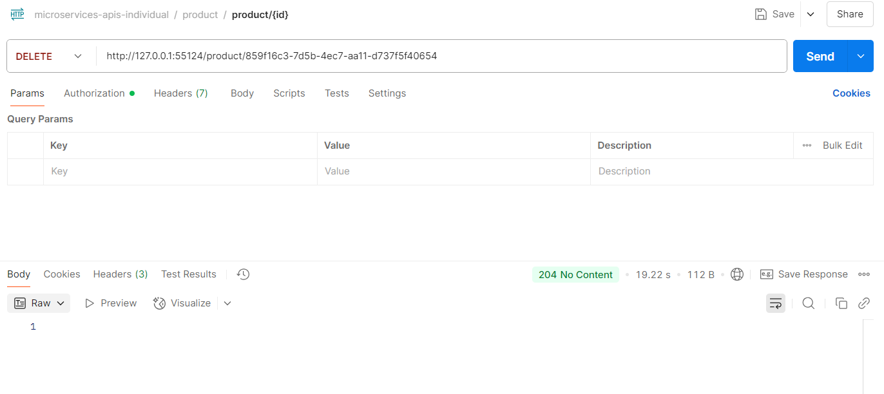

O Product API foi desenvolvido em **Spring Boot (Java)** e fornece um conjunto de endpoints REST para gerenciar produtos de uma loja. Todas as requisições passam pelo **API Gateway**, que valida o token JWT antes de encaminhar ao serviço.

---

## Endpoints Principais

**Criar novo produto**  
   - **POST** `/product`  
   - **Headers**:  
     ```
     Authorization: Bearer <token-JWT>
     ```  
   - **Request Body** (JSON):  
     ```json
     {
       "name": "Tomate",
       "price": 10.12,
       "unit": "kg"
     }
     ```  
   - **Response** (JSON — código HTTP 201 Created):  
     ```json
     {
       "id": "0195abfb-7074-73a9-9d26-b4b9fbaab0a8",
       "name": "Tomate",
       "price": 10.12,
       "unit": "kg"
     }
     ```  

**Listar todos os produtos**  
   - **GET** `/product`  
   - **Headers**:  
     ```
     Authorization: Bearer <token-JWT>
     ```  
   - **Response** (JSON Array — código HTTP 200 OK):  
     ```json
     [
       {
         "id": "0195abfb-7074-73a9-9d26-b4b9fbaab0a8",
         "name": "Tomate",
         "price": 10.12,
         "unit": "kg"
       },
       {
         "id": "0195abfe-e416-7052-be3b-27cdaf12a984",
         "name": "Queijo",
         "price": 0.62,
         "unit": "fatia"
       }
     ]
     ```  

**Obter produto por ID**  
   - **GET** `/product/{id}`  
   - **Headers**:  
     ```
     Authorization: Bearer <token-JWT>
     ```  
   - **Response** (JSON — código HTTP 200 OK):  
     ```json
     {
       "id": "0195abfb-7074-73a9-9d26-b4b9fbaab0a8",
       "name": "Tomate",
       "price": 10.12,
       "unit": "kg"
     }
     ```  
   - **Caso o produto não exista**: retorna **404 Not Found** com corpo vazio.  

**Deletar produto por ID**  
   - **DELETE** `/product/{id}`  
   - **Headers**:  
     ```
     Authorization: Bearer <token-JWT>
     ```  
   - **Response**:  
     - **204 No Content** se o produto existir e for removido com sucesso.  
     - **404 Not Found** se não encontrar o produto.  

---

## Autenticação

- Todas as chamadas aos endpoints acima exigem um **token JWT** válido.  
- O token deve ser produzido pelo **Auth Service** e passado no cabeçalho:

---

#### Diagrama de Integração com Gateway



---

#### Testes das rotas com Postman

_Teste com criação de um produto_

_Teste para ver todo os produtos cadastrados_

_Teste para ver um produto cadastrado específico_

_Teste para deletar um produto específico_

