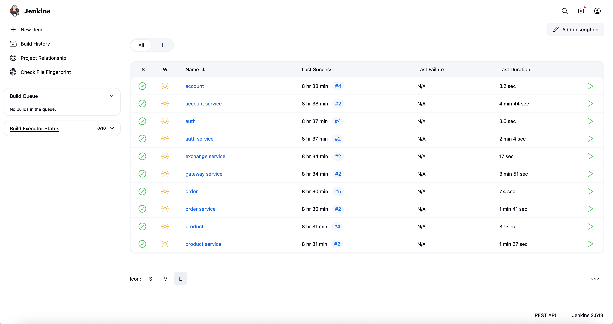

# Projeto em Grupo

## Visão Geral do Projeto

O projeto em grupo tem como objetivo aplicar práticas modernas de desenvolvimento em nuvem, DevOps e microserviços em um ambiente real de produção usando a AWS. As entregas foram organizadas em etapas práticas que abrangem desde a configuração da infraestrutura (AWS e EKS), testes de desempenho (HPA e carga), até o deploy automatizado com Jenkins (CI/CD). Além disso, cada grupo foi responsável por realizar uma análise de custos realista utilizando o AWS Pricing Calculator e calcular o uso de recursos com base em seu cluster. A entrega final inclui não apenas a implantação funcional da aplicação via EKS e banco de dados com RDS, mas também a documentação completa, uma apresentação de storytelling visual e um vídeo de demonstração entre 2 a 3 minutos. O projeto avalia tanto aspectos técnicos quanto de comunicação, destacando desafios enfrentados e práticas de engenharia adotadas, como o uso de PaaS, testes de carga e automatização de pipelines. Cada etapa do projeto contribui para uma formação sólida em arquitetura de sistemas distribuídos, cloud computing e entrega contínua.

## Objetivos

- Configurar a conta AWS para suportar o projeto.
- Provisionar e configurar corretamente o cluster EKS.
- Elaborar um plano de custos realista utilizando o AWS Pricing Calculator.
- Aplicar soluções PaaS para simplificar operações (RDS, EKS, ECR).
- Garantir que todos os microserviços estejam funcionando corretamente no ambiente de produção.

## Arquitetura

- **API Gateway**: Controla entrada e roteamento.
- **Auth**: Serviço de autenticação com JWT.
- **Exchange, Product, Order, Account**: serviços de domínio.
- **PostgreSQL**: banco de dados usado pelos serviços.

## Fluxo de requisição

1. Login no Auth → recebe token JWT  
2. Token usado no Gateway para acessar rotas protegidas  
3. Gateway redireciona para Account, Order ou Product  

## Deploy

- **Minikube**: usado em testes locais  
- **EKS**: usado na apresentação final  

---

> Toda a infraestrutura foi gerenciada com `kubectl`, arquivos YAML e Helm quando aplicável.

---

## Configuração AWS e EKS

Durante este projeto, nós configuramos a conta AWS e provisionamos um cluster EKS. Abaixo, uma captura de tela do cluster em execução:


Este cluster foi configurado para escalar automaticamente conforme a demanda usando Auto Scaling Groups e HPA.

**Endpoint da API em execução:**  
```
http://aef1f8f294b95439283d49dcde0dbde5-1733067101.sa-east-1.elb.amazonaws.com
```

---

## Análise de Custos

Utilizamos o AWS Pricing Calculator para gerar um plano de custo que reflete o uso estimado dos recursos no EKS:


**Relatório Consolidado (PDF)**  
   - [Baixar Análise de Custos (PDF)](files/cc4b9512-2a1b-47ac-8fa7-a9593a676627.pdf) 

A projeção acima demonstra os custos mensais esperados para manter o ambiente dormindo e em uso.

---

## PaaS

A plataforma como serviço (PaaS) é um modelo de computação em nuvem que fornece uma plataforma para desenvolver, executar e gerenciar aplicativos sem a complexidade de construir e manter a infraestrutura normalmente associada ao desenvolvimento e lançamento de aplicativos.


Durante o desenvolvimento, utilizamos PaaS da AWS de várias formas:

1. **Amazon Relational Database Service (RDS)**
   - O serviço de banco de dados PostgreSQL foi gerenciado pelo RDS, eliminando a necessidade de configurar e manter servidores de banco de dados.
   - Configuramos parâmetros de backup e alta disponibilidade diretamente na console do RDS, garantindo persistência e durabilidade dos dados.

2. **Amazon Elastic Kubernetes Service (EKS)**
   - Embora o EKS seja considerado um serviço gerenciado de Kubernetes (conhecido como Kubernetes como serviço), ele também se encaixa no modelo PaaS pois a AWS gerencia o plano de controle do cluster.
   - Utilizamos o EKS para orquestrar os microserviços sem precisar provisionar a instância do plano mestre nem gerenciar upgrades de versão do Kubernetes manualmente.

3. **Amazon Elastic Container Registry (ECR)**
   - Em vez de hospedar um repositório Docker local ou auto-hospedado, utilizamos o ECR para versionar e armazenar as imagens dos microserviços.
   - As pipelines do Jenkins fazem o push das imagens diretamente para o ECR, que oferece integração nativa com o EKS.
   - Com o ECR, não precisamos configurar servidores extras para registros de container.

Essas escolhas de PaaS reduziram o overhead operacional e permitiram que focássemos em codificação, monitoração e escalabilidade do cluster EKS.

---

## Vídeo de Demonstração

A seguir, nosso vídeo de demonstração, mostrando o projeto em funcionamento:

[](https://youtu.be/plfSACcGH5c)  
*Clique na imagem acima para ver o vídeo.*